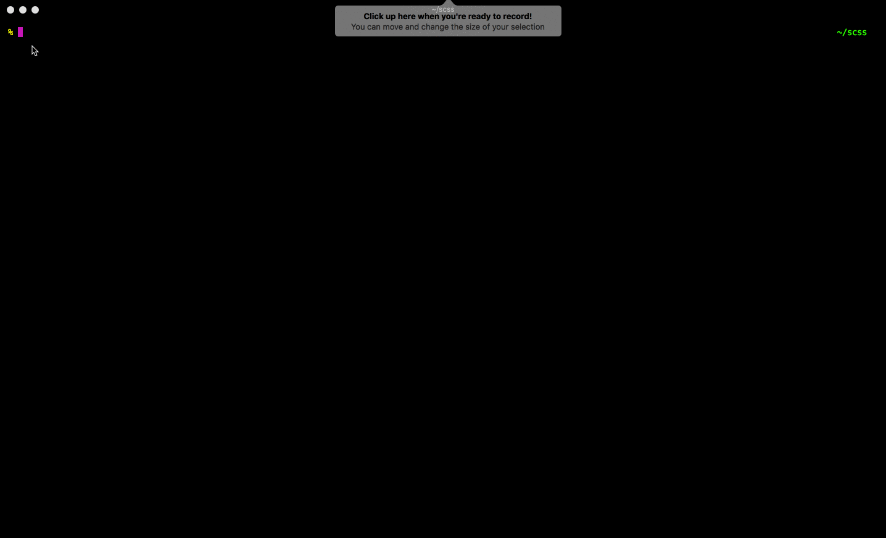
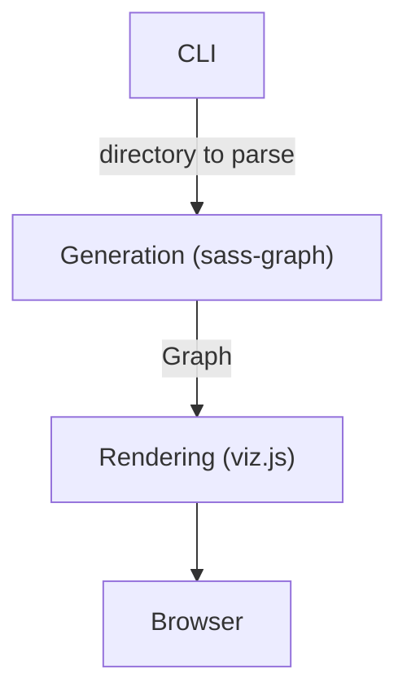

# Sass Graph Viz

Draw a visual graph of Sass dependencies.

---

[](https://www.npmjs.com/package/sass-graph-viz)
[](https://travis-ci.org/nicoespeon/sass-graph-viz)
[](https://github.com/nicoespeon/sass-graph-viz/blob/master/CHANGELOG.md)



## I want to use it…

> You need to install [node.js](https://nodejs.org/).

### As a command line tool

Install it with [npm](https://www.npmjs.com/package/sass-graph): `npm install -g sass-graph-viz`

```
$ sassgraphviz --help
Usage: sassgraphviz [options] <target>

Options:
  -e, --exclude-externals  Omit files that are not under given target
  -s, --simple             Generate a simpler visualization (not recommended for complex graphs)
  -p, --port <port>        Port to use [3000]
  -d, --debug              Output details for debugging purposes
  -h, --help               Output usage information
  -v, --version            Print sass-graph-viz version

Examples:
  sassgraphviz assets/scss
  sassgraphviz .
  sassgraphviz main.scss
  sassgraphviz main.scss -s -e -p 3001
```

You can also use the shorthand `sgv` instead of `sassgraphviz` (e.g. you can type `sgv assets/scss`).

### As a node.js library…

Install it locally to your project: `npm install --save-dev sass-graph-viz`

Then import it in your code:

```js
const sassGraphViz = require("sass-graph-viz");
```

#### To generate a visual graph

```ts
generateVisualGraph( target: string, options?: Options );
```

`target` can be a folder or a file.

`options` are optionals. Values are:

- `excludeExternals: boolean` to omit files that are not under given `target` (default `false`)
- `useSimpleViz: boolean` to generate a simpler visualization (default `false`)
- `withDebugLogs: boolean` to log details for debugging purposes (default `false`)
- `port: number` to use a custom port (default `3000`)

For instance:

- `sassGraphViz.generateVisualGraph('path/to/scss/')` to render the default graph
- `sassGraphViz.generateVisualGraph('path/to/scss/', { useSimpleViz: true })` for the simpler visualization
- `sassGraphViz.generateVisualGraph('path/to/scss/', { port: 3001 })` to use port `3001`

## I want to modify the source code…

> You need to install [yarn](https://yarnpkg.com/fr/).

First, clone the repository to get code locally: `git clone git@github.com:nicoespeon/sass-graph-viz.git`

Then, install dependencies: `yarn install` (or simply `yarn`)

Finally, if you do some changes, you need to rebuild the lib to use it: `yarn build` (or `yarn build:watch` for the watch mode).

### And test that nothing has broken

Run tests with `yarn test`.

This project uses [jest](https://jestjs.io/) as a test runner.

### And check the actual behavior of the code

Concrete scenarios are configured in `examples/`.

You can run one with `yarn examples:<name-of-the-example>`. For example:

- `yarn examples:basic-tree` will run the `examples/basic-tree/` scenario
- `yarn examples:simple-viz` will run the `examples/simple-viz/` scenario

You can run all examples with `yarn examples`.

## I want to contribute

:cowboy_hat_face: You're awesome!

Since this is the very beginning of the project, I didn't wrote a `CONTRIBUTING.md` yet. But you can go ahead, fork the repo, do your changes and create a Pull-Request.

I'm here to help. If you have any question, just ask with an issue.

If you don't feel like opening a PR, creating an issue to share some suggestions or report a bug is appreciated.

## I want to know who made that

Made with :heart: and :unicorn: by [Nicolas Carlo](https://twitter.com/nicoespeon) under the [MIT](https://choosealicense.com/licenses/mit/) license.

## I have further questions…

<details>
<summary>Why some nodes are grey, green or red?</summary>

Sass-graph-viz does its best to help you analyze your codebase. Colors add semantics to nodes:

- regular SCSS files are always legit, there is nothing we can tell, so they are **grey**
- partials which are imported by another file feel valid, so they are **green**
- orphan partials which are not imported are suspicious, so they are **red**

</details>

<details>
<summary>I've got LESS/CSS files in my codebase. Will it work?</summary>

Yes, it will.

It's not the main target of this library, but it can be handy if you need it. Plus, it was easy to enable, thanks to [sass-graph's work](https://github.com/xzyfer/sass-graph/pull/23).

</details>

<details>
<summary>What's the difference with sass-graph?</summary>

Indeed, there is this awesome lib called [sass-graph][sass-graph] which

> Parses Sass files in a directory and exposes a graph of dependencies.

I found it when I was looking for a lib to generate a graph of sass dependencies for a messy project. Unfortunately, it was only able to output some sort of graph in my terminal, or a json structure. I wanted something visual.

So I decided to **plug sass-graph with a rendering library**: this is the core of sass-graph-viz.

The difference is that sass-graph-viz generates a visual graph of dependencies in your browser.

</details>

<details>
<summary>How is this built?</summary>

It started with [sass-graph][sass-graph] and a rendering library. For the latter, I went with [viz.js](https://github.com/mdaines/viz.js) first because the API was simple and the result looked great.

The core idea is:

1. Expose a CLI command to get the path to the directory I want to parse
2. Delegates to sass-graph the generation of dependencies graph
3. Translate sass-graph's Graph into my `Graph` model
4. Delegates to viz.js the rendering of the `Graph` in the browser




Once I got the core idea, I can switch the infrastructure to use any concrete implementation I want, as long as it fulfills the expected interfaces.

> If you're into [Hexagonal Architecture](http://fideloper.com/hexagonal-architecture), it may sounds like ports & adapters. It is, but I didn't made interfaces & the hexagon explicit yet (functions and types are simple enough).

For example, in v1, there are also:

- A node.js API that is consumed in the examples (which are manual E2E tests of the visual result)
- Another rendering solution using [vis](http://visjs.org) (because viz.js was not enough for real-life graphs)

[sass-graph]: https://www.npmjs.com/package/sass-graph

</details>
